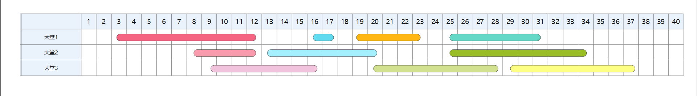

# Project2

姓名：赵书誉

学号：18307110072


## 1、The maximum-subarray problem

#### 代码部分

```
/*暴力求解法*/
public static int[] bruteForce(int[] change,int low,int high){
    int max = 0;    //初始化最大利润值与买卖策略
    int[] strategy = {0,0,0};
    for (int start = low;start<=high;start++){    //循环1：开始时间（从买入后第二天算起）
        int profit = change[start]; //设置变量记录利润
        for (int end = start+1;end<=high;end++){    //循环2：结束时间（卖出后的当天）
            profit += change[end];  //计算利润
            if (profit>max){    //修改最大利润
                max = profit;
                strategy[0] = start;
                strategy[1] = end;
                strategy[2] = profit;
            }
        }
    }
    return strategy;
}

/*递归求解法*/
public static int[] MaxSubArray(int[] A,int start,int end){
    if (start==end){	//返回数值
        return new int[]{start,end,A[end]};
    }
    else{
        int mid = (start+end)/2;
        int[] left = MaxSubArray(A,start,mid);	//左侧最大值
        int[] right = MaxSubArray(A,mid+1,end);	//右侧最大值
        int[] cross = MaxCrossArray(A,start,mid,end);	//中间最大值
        if (left[2] >= right[2] && left[2] >= cross[2])
            return left;
        else if(right[2] >= left[2] && right[2] >= cross[2])
            return right;
        else
            return cross;
    }
}
public static int[] MaxCrossArray(int[] A,int start,int mid,int end){
    int leftMax = 0,rightMax = 0,left = mid,right = mid;
    int sum = 0;	
    for (int i = mid; i >= start; i--){	//先计算往左能获得的最大连续数组
        sum += A[i];
        if (sum >= leftMax){
            leftMax = sum;
            left = i;
        }
    }
    sum = 0;
    for (int i = mid+1; i <= end; i++){	//计算右侧开始能获得的最大连续数组
        sum += A[i];
        if (sum >= rightMax){
            rightMax = sum;
            right = i;
        }
    }
    return new int[]{left,right,leftMax+rightMax};
}

/*动态规划法*/
public static int[] Dynamic(int[] change,int low,int high){
    int[] res= new int[3];  //初始化
    int start = 1;
    int sum = 0;
    for (int i=low;i<=high;i++){
        sum += change[i];   //计算当前利润
        if(sum>res[2]){     //修改最大利润
            res[0] = start;
            res[1] = i;
            res[2] = sum;
        }
        else if (sum<0){    //如果此刻利润值为负数，说明最大利润策略里不包含之前的时间段
            sum = 0;    //重新设为0，修改买入时间
            start = i+1;
        }
    }
    return res;
}
```


#### Q1：

取20次运行时间的平均值

| pdf中案例      | brute force | recursive algorithms | Dynamic |
| -------------- | :---------: | :------------------: | ------- |
| Time cost (ns) |    9550     |        15450         | 2045    |


测试下得n<sub>0</sub>= 26。


修改递归算法后递归算法效率就比暴力枚举法要高了


#### Q2：

暴力求解法与动态规划法均能修改成可返回空子串，因为若最大值为0，则保存的start值与end值相等且皆为0，做个判断即可返回空子串。


## 2、Interval-graph coloring problem

#### 代码部分

```
/*用于储存活动始末的类*/
public static class Activity{
    int num;
    int startTime;
    int endTime;
    public Activity(int num,int startTime,int endTime){
        this.num = num;
        this.startTime = startTime;
        this.endTime = endTime;
    }
}

/*贪婪算法*/
public static void GraphColoring(Activity[] activities){
    for (int i=0;i<activities.length;i++){	//先将活动按结束时间升序排序
        for (int j=activities.length-1;j>i;j--){
            if (activities[j].endTime < activities[j-1].endTime){
                Activity temp = activities[j];
                activities[j] = activities[j-1];
                activities[j-1] = temp;
            }
        }
    }
    boolean[] used = new boolean[activities.length];	//查看活动是否已被安排的布尔数组
    boolean over = false;
    int hall = 1;
    while (!over){	
        over = true;
        int temp = -1;
        for (int i=0;i<activities.length;i++){
            if (!used[i] && activities[i].startTime > temp){	//如果该活动未被安排且时间不冲突
                if (over){	//尚未安排大厅
                    System.out.print("Hall "+hall+": ");
                }
                temp = activities[i].endTime;	//记录新活动结束时间
                used[i] = true;
                System.out.print(activities[i].num+" ");	//输出活动编号
                over = false;	//存在新活动，循环不应结束
            }
        }
        System.out.println();
        hall++;	//大厅编号
    }
}
```


#### Q1：

该算法的思想是多次使用贪婪算法，让每个大厅中可举办的活动最多，从而总体最优。

最坏的情况为所有活动相互冲突，while循环n次，每次for循环开销为 Θ(n)，时间复杂度为O(n<sup>2</sup>)

上网查得如果只用考虑所需大厅数量，可以用将时间复杂度降低至O(nlogn)


#### Q2：

**案例**

| 编号     | 1    | 2    | 3    | 4    | 5    | 6    | 7    | 8    | 9    | 10   |
| -------- | ---- | ---- | ---- | ---- | ---- | ---- | ---- | ---- | ---- | ---- |
| 开始时间 | 29   | 19   | 3    | 20   | 8    | 9    | 16   | 25   | 25   | 13   |
| 结束时间 | 37   | 23   | 12   | 28   | 12   | 16   | 17   | 31   | 34   | 20   |

Step1：按结束时间升序排序

| 编号     | 3    | 5    | 6    | 7    | 10   | 2    | 4    | 8    | 9    | 1    |
| -------- | ---- | ---- | ---- | ---- | ---- | ---- | ---- | ---- | ---- | ---- |
| 开始时间 | 3    | 8    | 9    | 16   | 13   | 19   | 20   | 25   | 25   | 29   |
| 结束时间 | 12   | 12   | 16   | 17   | 20   | 23   | 28   | 31   | 34   | 37   |

Step2：根据贪婪算法找出活动安排方案

第一个大堂：安排活动3，因为活动5和6的开始时间大于3的结束时间，跳过，安排活动7，活动10冲突，安排活动2，活动4冲突，安排活动8，活动9和1均冲突，至此，大堂1的活动安排结束。

第二个大堂：3已安排过，将活动5置入，然后是活动10，活动9。

第三个大堂：安排活动6，活动4，活动1。




## 3、Beam Search

```
/*树结构*/
public static class Decision_Tree{
    Node root;
    public Decision_Tree(){
        this.root = new Node("",1);	//初始概率为1
    }
}
/*节点结构*/
public static class Node{
    String name;
    double probability;
    ArrayList<Node> choice = new ArrayList<>();	//该点可供的选项
    public Node(String name,double value){
        this.name = name;
        this.probability = value;
    }
    public void add(String name,double value){	//添加选项
        Node node = new Node(this.name+"→"+name,value);
        this.choice.add(node);
    }
}


public static void beamSearch(Node root,int k){
    double[] prob = null;	//用于保存最大的概率及对应的选法的数组
    Node[] nodes = null;
    Node node = root;
    while(node != null){	//循环直至叶子节点
        double[] tempMax = new double[k];	//用于保存当前概率最大的选项
        Node[] tempNode = new Node[k];
        if (nodes == null){	//第一次循环
            for (int j = 0; j < root.choice.size(); j++) {
                node = root.choice.get(j);
                double temp = node.probability;
                if (temp > tempMax[k-1]) {	//如果比保存的选项中概率最小的大，就将其保存并删去概率最小的那个选项
                    insertSort(tempMax,tempNode,node,temp);
                }
            }
        }
        else {	//不是第一次循环
            for (int i = 0; i < k; i++) {	
                node = nodes[i];	//之前保存的概率最大的节点
                double prevP = prob[i];	//相应的概率
                if (node == null){	//如果节点为空，说明之前一个循环时k个分支未填满，当前循环中所有可能性已考虑完毕，直接进入下一个循环
                    node = nodes[0];
                    break;
                }
                else if (node.choice.size()==0){	//已经是叶子节点
                    System.out.println(node.name+" "+prevP);	//输出选项以及其概率
                    node = null;
                    continue;
                }
                for (int j = 0; j < node.choice.size(); j++) {	//遍历该节点下所有可能选项
                    double temp = node.choice.get(j).probability * prevP;
                    if (temp > tempMax[k-1]) {
                        insertSort(tempMax,tempNode,node.choice.get(j),temp);
                    }
                }
            }
        }
        prob = tempMax;
        nodes = tempNode;
    }
}

public static void insertSort(double[] tempMax,Node[] nodes,Node choice,double probability){//插入排序
    int pos = tempMax.length-2;
    while(pos >= 0 && tempMax[pos] < probability){
        tempMax[pos+1] = tempMax[pos];
        nodes[pos+1] = nodes[pos];
        pos--;
    }
    pos++;
    tempMax[pos] = probability;
    nodes[pos] = choice;
}
```


#### Q1：

案例如下所示：


k=4时

Step1：因为只有三个选项，ABC均被作为候选项

Step2：以A选项为前提，将AA，AB，AC加入候选项；以B选项为前提，将BA加入候选项，因为BC概率大于AC，将BC加入，除去AC；以C选项为前提，CA，CB，CC概率均小于候选项概率，故不加入。

Step3：分别从AA，AB，BA，BC四个选项出发，从4x3=12个选项中选出概率最大的四个选项，为BB，BC，CB，CC。


#### Q2：

当k取3时，会发现输出的选项为ABC，ABB，BAB，其中BAB的概率为0.06，小于选项BCB，BCC，这是由于BC选项在前一步中并没有被当作候选项导致。

显然，如果仅考虑算法结果的正确性，暴力枚举法是非常合适的，它不会遗漏任何一个可能的选项，并会从中找出最符合要求的选项。然而这种方法效率十分低，会耗费大量时间，而贪婪算法则相反，每次都只选择当前最符合的选项作为候选项，而不顾虑之后的变化，大幅提高了算法的运行效率，但这种算法显然具有局限性，就如书中举的搬金砖的例子，局部最优解不一定会导致整体最优。

Beam Search则是结合了暴力枚举与贪婪算法，兼顾正确性与效率，将当前最符合的几个选项作为候选项，以此为前提遍历，更具备普适性，k值越大，越接近暴力枚举，k=1时则是贪婪算法，可以根据需要调整k值大小。